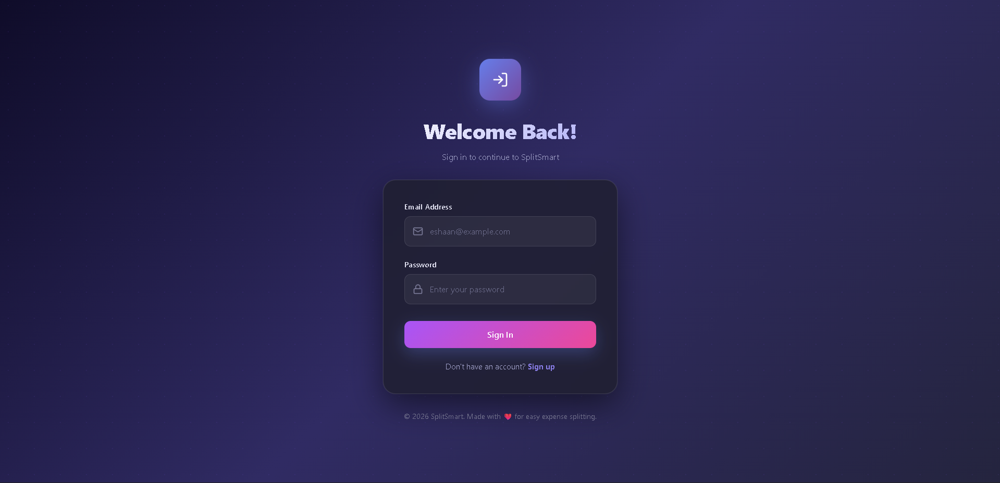
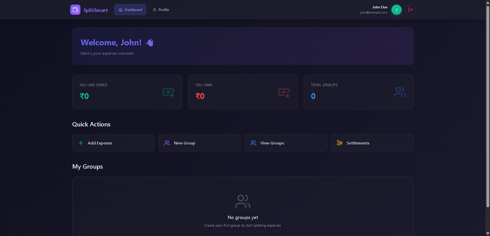
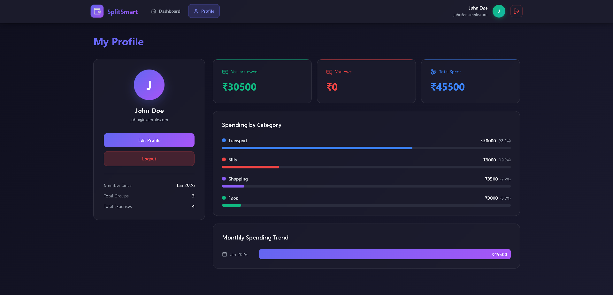
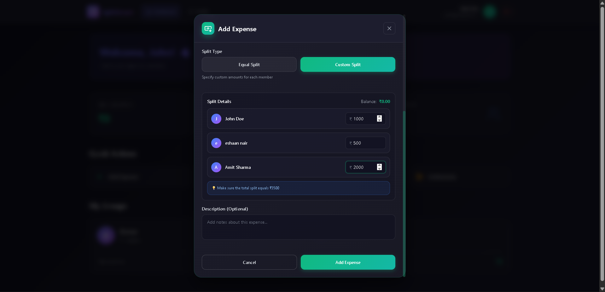
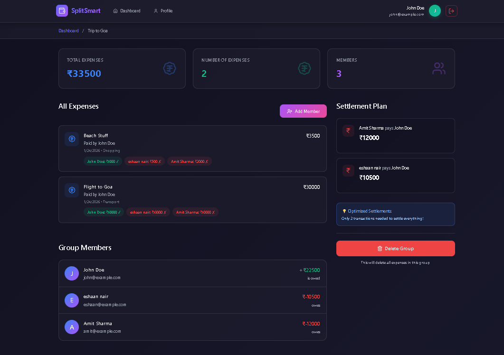
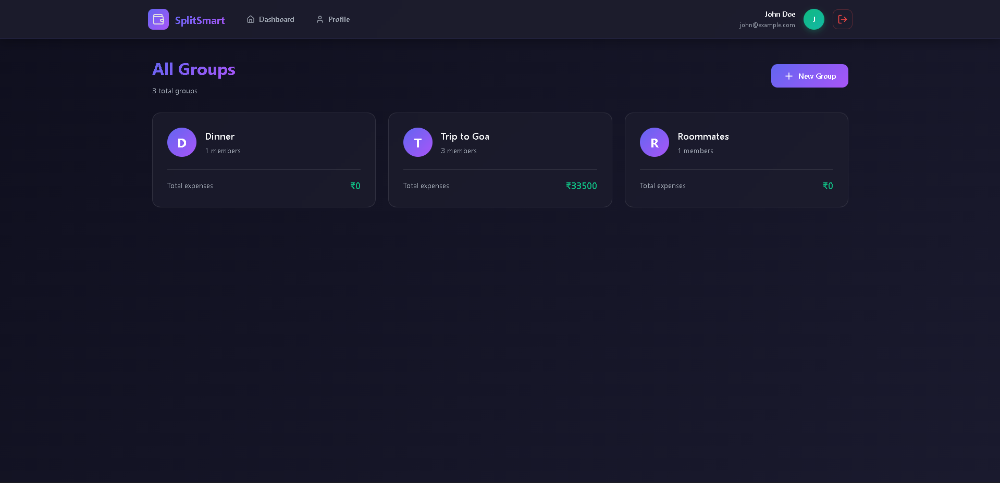
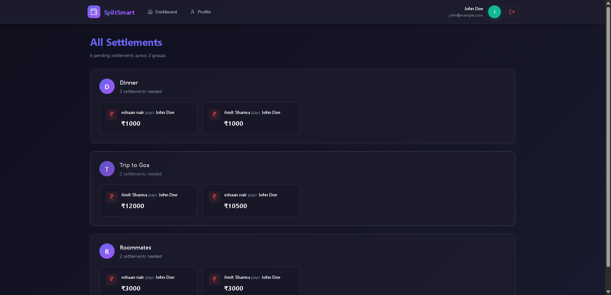
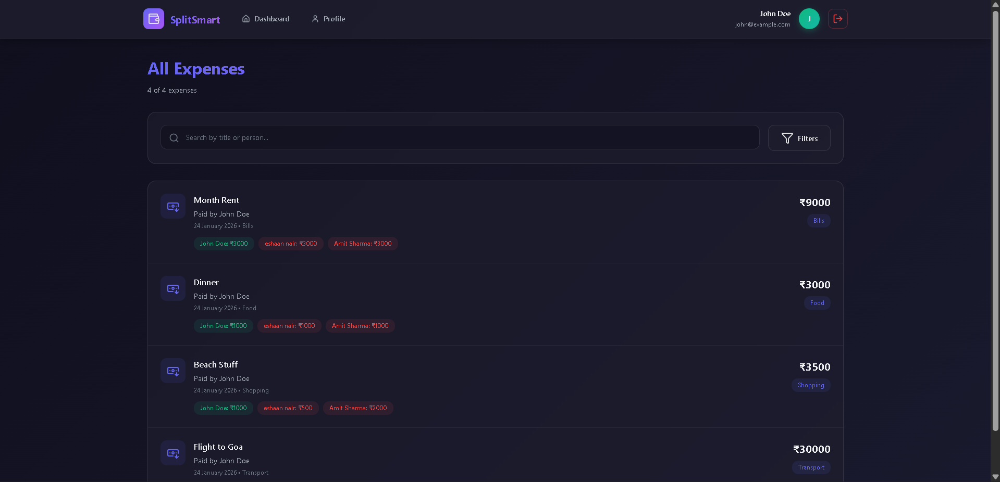

<div align="center">

# 💰 SplitSmart

### Intelligent Expense Splitting Platform

[](https://reactjs.org/)
[](https://www.mongodb.com/)
[](https://expressjs.com/)
[](https://nodejs.org/)
[](https://reactjs.org/)

**Simplify group expenses with smart debt settlement algorithms**

<!-- [Live Demo](#) •  -->
[Features](#-features) • [Installation](#-installation) • [Algorithm](#-the-magic-settlement-algorithm) • [API Docs](#-api-endpoints)

</div>

---

## 📑 Table of Contents

- [About](#-about)
- [Features](#-features)
- [Tech Stack](#-tech-stack)
- [Installation](#-installation)
- [Usage](#-usage)
- [Settlement Algorithm](#-the-magic-settlement-algorithm)
- [API Endpoints](#-api-endpoints)
- [Project Structure](#-project-structure)
- [Screenshots](#-screenshots)

---

## 🎯 About

**SplitSmart** is a full-stack web application that revolutionizes how groups manage shared expenses. Built with the MERN stack, it uses advanced graph-based algorithms to minimize the number of transactions needed to settle group debts.

### Why SplitSmart?

**The Problem:** 

In a group of 4 friends with 10 different shared expenses, traditional methods could require 10+ separate payment transactions to settle everything.

When the number of expenses grows large, keeping track of who owes whom becomes challenging. Different expense split types can further add to the confusion.

**My Solution:** 

SplitSmart's intelligent algorithm reduces this to just 2-3 optimized transactions, saving time and reducing payment complexity by up to **70%**.

### Perfect For:

- 🏠 **Roommates** - Split rent, utilities, and groceries
- ✈️ **Travel Groups** - Manage trip expenses seamlessly
- 🍕 **Friends** - Share meal and activity costs
- 💼 **Teams** - Handle group purchases and events

---

## ✨ Features

### 🔥 Core Features

| Feature | Description |
|---------|-------------|
| **Smart Settlements** | Graph-based algorithm minimizes transactions (O(n log n) complexity) |
| **Flexible Splitting** | Equal or custom splits with real-time validation |
| **Multi-Group Support** | Manage unlimited groups simultaneously |
| **Real-time Balances** | Instant calculation of who owes whom |
| **Expense Categories** | Food, Transport, Shopping, Entertainment, Bills, Other |
| **Search & Filter** | Find expenses by date, category, or person |

### 📊 Advanced Features

| Feature | Description |
|---------|-------------|
| **Expense Analytics** | Visual breakdown by category with progress bars |
| **Monthly Trends** | Track spending patterns over time |
| **Profile Dashboard** | Personal spending statistics and history |
| **Settlement Tracking** | Mark payments as complete |
| **Member Management** | Add/remove group members easily |
| **Responsive Design** | Seamless experience on all devices |

### 🔐 Security & Auth

- **JWT Authentication** - Secure token-based login
- **Password Hashing** - Bcrypt encryption (10 rounds)
- **Protected Routes** - Client-side and server-side route protection
- **Input Validation** - Comprehensive validation on all inputs

---

## 🛠️ Tech Stack

<table>
<tr>
<td width="50%" valign="top">

### Frontend
```
React 18.2          - UI Library
React Router 6      - Navigation
Tailwind CSS 3      - Styling
Axios              - HTTP Client
Lucide React       - Icons
React Hot Toast    - Notifications
```

</td>
<td width="50%" valign="top">

### Backend
```
Node.js 18+        - Runtime
Express.js 4       - Framework
MongoDB 6+         - Database
Mongoose 7         - ODM
JWT                - Auth Tokens
Bcrypt.js         - Encryption
```

</td>
</tr>
</table>

---

## 🚀 Installation [Only works locally as of now]

### Prerequisites
```bash
Node.js >= 18.0.0
MongoDB >= 6.0.0
npm >= 9.0.0
Git
```

### Quick Start

#### 1️⃣ Clone the Repository
```bash
git clone https://github.com/yourusername/smart-expense-splitter.git
cd smart-expense-splitter
```

#### 2️⃣ Backend Setup
```bash
cd backend
npm install

# Create .env file
cat > .env << EOF
MONGO_URI=mongodb://127.0.0.1:27017/splitsmart
PORT=5000
JWT_SECRET=your_super_secret_jwt_key_change_this_in_production
NODE_ENV=development
EOF

# Start MongoDB (in separate terminal)
mongod

# Start backend server
npm start
```

**Expected Output:**
```
MongoDB Connected
Server is running on port 5000
```

#### 3️⃣ Frontend Setup
```bash
cd ../frontend
npm install

# Start React app
npm start
```

**Expected Output:**
```
Compiled successfully!
Local: http://localhost:3000
```

#### 4️⃣ Access the Application

Open your browser and navigate to:
```
http://localhost:3000
```

---

## 📱 Usage

### First-Time User Flow

1. **Register** - Create your account at `/register`
2. **Create Group** - Click "New Group" and add members by email
3. **Add Expense** - Click "Add Expense", enter details, choose split type
4. **View Balance** - See who owes whom in real-time
5. **Settle Up** - Mark payments as paid when settled

### Example Workflow
```
Scenario: 4 roommates sharing apartment expenses

Step 1: Create group "Apartment Mates"
        Add: Amit, Priya, Rahul, Neha

Step 2: Add expenses over the month
        - Amit pays rent: ₹40,000 (split equally)
        - Priya buys groceries: ₹3,000 (split equally)
        - Rahul pays electricity: ₹2,000 (split equally)
        - Neha pays internet: ₹1,500 (split equally)

Step 3: View Settlement Plan
        Without SplitSmart: 12 transactions needed
        With SplitSmart: Only 3 transactions! ✨
        
        Optimized Plan:
        - Priya pays Amit ₹8,625
        - Rahul pays Amit ₹9,500
        - Neha pays Amit ₹10,125
        
Step 4: Mark as paid when settled
```

---

## 🧮 The Magic: Settlement Algorithm

### Problem Statement-

Given a group with multiple expenses where different people paid different amounts, find the **minimum number of transactions** needed to settle all debts.

### Solution: Greedy Algorithm with Two Pointers

**Time Complexity:** O(n log n)  
**Space Complexity:** O(n)

### How It Works
```javascript
Step 1: Calculate Net Balance for Each Person
   - Sum of (money they are owed - money they owe)
   
Step 2: Separate into Debtors and Creditors
   - Debtors: People who owe money (negative balance)
   - Creditors: People who are owed money (positive balance)
   
Step 3: Sort Both Lists (Greedy Approach)
   - Largest debts first
   - Largest credits first
   
Step 4: Match Debtors with Creditors
   - Use two-pointer technique
   - Settle maximum amount possible per transaction
   - Move to next person when balance reaches zero
```

### Example
```
Input: 4 people, 6 expenses

Amit:  Paid ₹1000, Owes ₹300  → Balance: +₹700
Priya: Paid ₹500,  Owes ₹400  → Balance: +₹100
Rahul: Paid ₹200,  Owes ₹600  → Balance: -₹400
Neha:  Paid ₹100,  Owes ₹500  → Balance: -₹400

Naive Approach: 6 transactions (one per expense)

SplitSmart Algorithm: 3 transactions
  1. Rahul pays Amit ₹400
  2. Neha pays Amit ₹300
  3. Neha pays Priya ₹100
  
Reduction: 50% fewer transactions! 🎉
```

### Code Implementation
```javascript
const optimizeSettlements = (balances) => {
  const settlements = [];
  const debtors = [];
  const creditors = [];

  // Separate debtors and creditors
  for (let userId in balances) {
    if (balances[userId] < 0) {
      debtors.push({ userId, amount: Math.abs(balances[userId]) });
    } else if (balances[userId] > 0) {
      creditors.push({ userId, amount: balances[userId] });
    }
  }

  // Sort by amount (greedy approach)
  debtors.sort((a, b) => b.amount - a.amount);
  creditors.sort((a, b) => b.amount - a.amount);

  // Two-pointer settlement
  let i = 0, j = 0;
  while (i < debtors.length && j < creditors.length) {
    const settleAmount = Math.min(debtors[i].amount, creditors[j].amount);
    
    settlements.push({
      from: debtors[i].userId,
      to: creditors[j].userId,
      amount: settleAmount
    });

    debtors[i].amount -= settleAmount;
    creditors[j].amount -= settleAmount;

    if (debtors[i].amount === 0) i++;
    if (creditors[j].amount === 0) j++;
  }

  return settlements;
};
```

---

## 📡 API Endpoints

### Authentication

| Method | Endpoint | Description |
|--------|----------|-------------|
| POST | `/api/auth/register` | Register new user |
| POST | `/api/auth/login` | Login user |

### Groups

| Method | Endpoint | Description |
|--------|----------|-------------|
| POST | `/api/groups` | Create new group |
| GET | `/api/groups` | Get all user's groups |
| GET | `/api/groups/:id` | Get specific group |
| POST | `/api/groups/:id/members` | Add member to group |
| DELETE | `/api/groups/:id` | Delete group |

### Expenses

| Method | Endpoint | Description |
|--------|----------|-------------|
| POST | `/api/expenses` | Create new expense |
| GET | `/api/expenses/group/:groupId` | Get group expenses |
| GET | `/api/expenses/:id` | Get specific expense |
| POST | `/api/expenses/settle` | Mark expense as settled |
| DELETE | `/api/expenses/:id` | Delete expense |

### Settlements

| Method | Endpoint | Description |
|--------|----------|-------------|
| GET | `/api/settlements/user` | Get user's balance summary |
| GET | `/api/settlements/group/:groupId` | Get optimized settlements for group |
| GET | `/api/settlements/suggestions/:groupId` | Get settlement suggestions |

### Example Request
```javascript
// Create Expense
POST /api/expenses
Headers: { Authorization: "Bearer <token>" }
Body: {
  "title": "Dinner at Pizza Hut",
  "amount": 1200,
  "category": "Food",
  "groupId": "group123",
  "splitType": "equal"
}

// Response
{
  "success": true,
  "message": "Expense created successfully",
  "expense": {
    "_id": "exp123",
    "title": "Dinner at Pizza Hut",
    "amount": 1200,
    "splitBetween": [
      { "user": "user1", "amount": 300, "isPaid": true },
      { "user": "user2", "amount": 300, "isPaid": false },
      { "user": "user3", "amount": 300, "isPaid": false },
      { "user": "user4", "amount": 300, "isPaid": false }
    ]
  }
}
```

---

## 📁 Project Structure
```
smart-expense-splitter/
├── backend/
│   ├── config/
│   │   └── db.js                    # MongoDB connection
│   ├── controllers/
│   │   ├── authController.js        # Auth logic
│   │   ├── groupController.js       # Group CRUD
│   │   ├── expenseController.js     # Expense CRUD
│   │   └── settlementController.js  # Settlement calculations
│   ├── middleware/
│   │   └── authMiddleware.js        # JWT verification
│   ├── models/
│   │   ├── User.js                  # User schema
│   │   ├── Group.js                 # Group schema
│   │   └── Expense.js               # Expense schema
│   ├── routes/
│   │   ├── authRoutes.js
│   │   ├── groupRoutes.js
│   │   ├── expenseRoutes.js
│   │   └── settlementRoutes.js
│   ├── utils/
│   │   └── settlementAlgorithm.js   # ⭐ Core algorithm
│   ├── .env
│   ├── package.json
│   └── server.js                    # Entry point
│
├── frontend/
│   ├── public/
│   ├── src/
│   │   ├── components/
│   │   │   ├── auth/
│   │   │   ├── groups/
│   │   │   │   └── CreateGroupModal.js
│   │   │   ├── expenses/
│   │   │   │   └── CreateExpenseModal.js
│   │   │   ├── settlements/
│   │   │   └── layout/
│   │   │       ├── Navbar.js
│   │   │       └── LoadingSpinner.js
│   │   ├── pages/
│   │   │   ├── Login.js
│   │   │   ├── Register.js
│   │   │   ├── Dashboard.js        # Main dashboard
│   │   │   ├── GroupDetails.js     # Single group view
│   │   │   ├── AllGroups.js        # All groups list
│   │   │   ├── AllExpenses.js      # All expenses (with search/filter)
│   │   │   ├── AllSettlements.js   # All settlements
│   │   │   ├── Profile.js          # User profile with analytics
│   │   │   └── NotFound.js
│   │   ├── context/
│   │   │   └── AuthContext.js      # Global auth state
│   │   ├── utils/
│   │   │   └── api.js              # Axios config
│   │   ├── App.js                  # Route config
│   │   ├── index.js
│   │   └── index.css               # Tailwind imports
│   ├── package.json
│   └── tailwind.config.js
│
└── README.md                        # You are here!
```

---

## 📸 Screenshots

<div align="center">

### <u>Register</u> - *User Registration Page*


### <u>Login</u> - *User Login Page*


### <u>Dashboard</u> - *User Account Dashboard*


### <u>Profile</u> - *User Profile Page*


### <u>Add Expense</u> - *Equal Split Between Group Members*


### <u>Add Expense</u> – *Custom Unequal Split Among Group Members*


### <u>Create Group</u> - *Create New Group*


### <u>Group Details</u> - *View group Information*   


### <u>View All Groups</u> - *See All Groups User is in*


### <u>Settlements</u> - *Minimize Transactions Between Members*


### <u>All Expenses</u> - *Expense History*


</div>

---

## 🎓 Key Learning Points

### Technical Skills Demonstrated

- **Full-Stack Development** - Complete MERN stack implementation
- **Algorithm Design** - Graph theory and greedy algorithms (O(n log n))
- **State Management** - React Context API and hooks
- **API Design** - RESTful architecture with proper HTTP methods
- **Database Design** - MongoDB schema design with references
- **Authentication** - JWT tokens and bcrypt hashing
- **UI/UX Design** - Responsive design with Tailwind CSS
- **Error Handling** - Comprehensive validation and error messages

---

## 🚀 Future Enhancements

### Potential Features

- [ ] **Email Notifications** - Remind users of pending settlements
- [ ] **Receipt Upload (OCR)** - Scan receipts to auto-create expenses **[Planned]**
- [ ] **Multi-Currency Support** - Handle expenses in different currencies
- [ ] **Recurring Expenses** - Auto-create monthly bills (rent, utilities)
- [ ] **Export to PDF** - Download expense reports **[Planned]**
- [ ] **Mobile App** - React Native version
- [ ] **Split by Percentage** - More flexible splitting options **[Planned]**
- [ ] **Budget Limits** - Set spending limits per category
- [ ] **Integration APIs** - Connect with Venmo, PayPal, etc.

---


## 👨‍💻 Author

**Eshaan Nair**

- GitHub: [@Eshaan-Nair](https://github.com/Eshaan-Nair)

---

## 🙏 Acknowledgments

- Inspired by Splitwise and similar expense-splitting apps
- UI components styled with Tailwind CSS
- Icons from Lucide React

---

<div align="center">

### ⭐ If you found this project helpful, please give it a star!

Made with ❤️ for simplifying group expenses

[Back to Top](#-splitsmart)

</div>